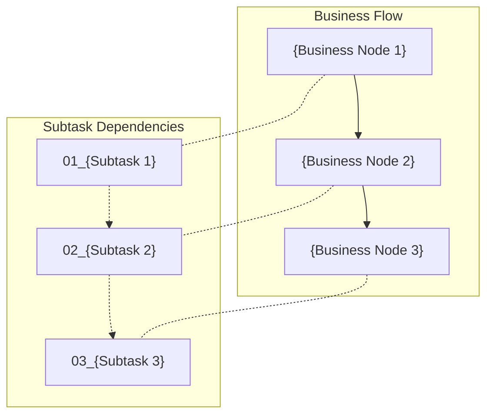

# {Task Name}

## Overview

{Brief description of the overall task, including background, purpose, and scope. 1-3 paragraphs.}

## Overall Objectives

- {Objective 1}
- {Objective 2}
- {Objective 3}

## Subtask Progress

| # | Subtask | Filename | Status | Description |
|---|---------|----------|--------|-------------|
| 01 | {Subtask name} | {filename}.md | Not Started | {Brief description} |
| 02 | {Subtask name} | {filename}.md | Not Started | {Brief description} |

## Development Order

Develop in the following order. Later tasks may depend on outputs from earlier tasks:

1. **{Subtask 1}** — {Reason for this ordering}
2. **{Subtask 2}** — {Reason for this ordering}

## Business Flow & Subtask Dependencies

> Legend: Solid arrows = business flow direction, Dashed arrows = subtask dependencies, Dotted lines = mapping between business nodes and subtasks.

## Tech Stack

- {Tech stack information, extracted from conversation context}

## Notes

{Other important notes, such as constraints, risks, or considerations}
